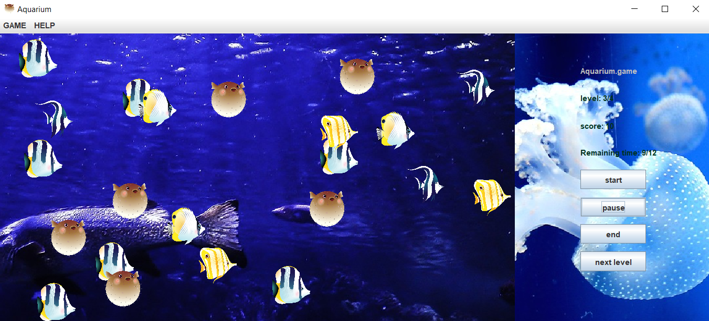

# Aquarium

## Overview

An action game where the focus is entirely on catching fish in the aquarium. The game tests the player's spatial awareness, reflexes, and speed.

## Screenshots



<p align="right">(<a href="#aquarium">back to top</a>)</p>

## Configuration

Application use properties to store simple parameters as key-value pairs, outside of compiled code. Java has built-in support for properties through the java.util.Properties class, which is a utility class specifically designed to handle configuration files. It is used to keep track of a list of values where each value is associated with a unique string key. This allows for easy storage and retrieval of string data from the properties file.

To modify application parameters:

1. Open src/main/resources/configuration folder
2. You may notice files (parameters.txt, scenario.txt) containing a collection of properties 
3.  Modify some of the properties then save the files and restart the application

You can also generate random parameters, for this purpose use the ready-made random generators available in the src/main/java/org/aquarium/utils/configuration

<p align="right">(<a href="#aquarium">back to top</a>)</p>

## Getting Started

Below you can find instructions on how to set up the app. Run as you would normally run a Java application with Maven. You are not going to pass any parameters, and the program does not require any specific actions to be performed before start, you can run it right from the editor or use the terminal.

### IntelliJ IDEA
1. Clone this repository
```sh
$ git clone https://github.com/your_username_/Project-Name.git
```
2. Open the project in IntelliJ IDEA
3. Select _File > Project Structure..._ and ensure that the Project SDK and language level are set to use Java 17.
4. Select _Run > Run 'Main.java'_

### Command Line
1. Clone this repository
```sh
$ git clone https://github.com/KrzysztofDamianBasior/Aquarium.git
```
2. Move to the repository root folder in command line
```sh
$ cd ~/Aquarium
```
3. Run
```sh
$ mvn compile
$ mvn exec:java -Dexec.mainClass=org.aquarium.Main
```
<p align="right">(<a href="#aquarium">back to top</a>)</p>

## Requirements

To clone and run this application, you'll need [Git](https://git-scm.com), [maven](https://maven.apache.org/) and [Java 17](https://www.java.com/en/) installed on your computer.

<p align="right">(<a href="#aquarium">back to top</a>)</p>

## License

Distributed under the MIT License. See `LICENSE.txt` for more information.

<p align="right">(<a href="#aquarium">back to top</a>)</p>